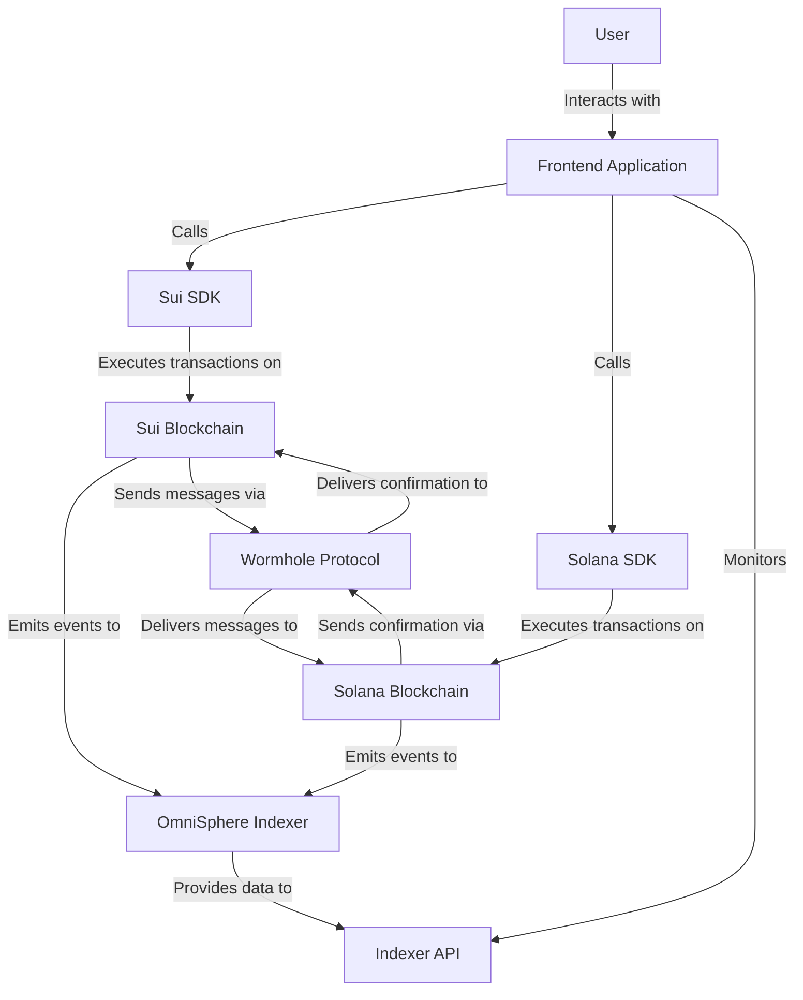
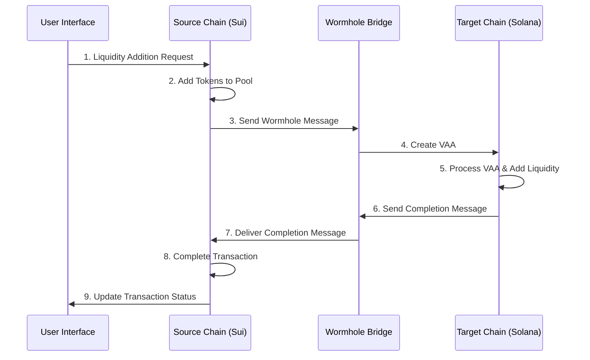
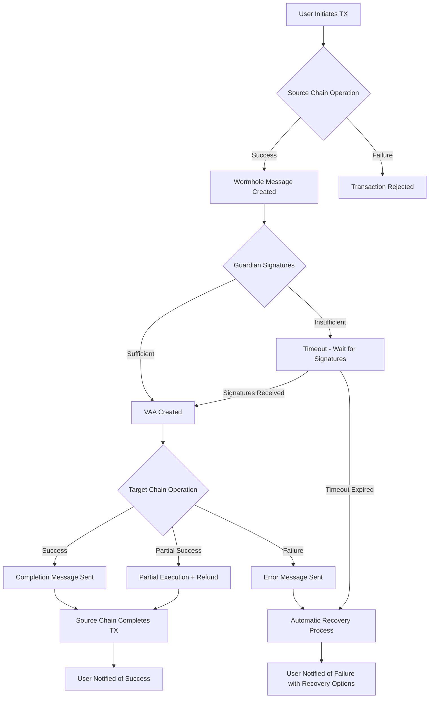

# OmniSphere: Multi-Universe Liquidity Protocol

[](https://opensource.org/licenses/MIT)
[](https://sui.io/)
[](https://solana.com/)
[](https://wormhole.com/)

<div align="center">
  
</div>


> **OmniSphere** is a revolutionary cross-chain liquidity protocol that enables atomic composition of liquidity across multiple blockchain universes, powered by Sui's high-performance ecosystem and Wormhole's interoperability infrastructure.

---

## ✨ Deployment Status & Demo

🚀 **Contracts Deployed!**

The core smart contracts for OmniSphere have been successfully deployed:

*   **Sui Testnet:** Package ID `0xee971f83a4e21e2e1c129d4ea7478451a161fe7efd96e76c576a4df04bda6f4e`. See [Section 4.6](#46-deployment-information-%EF%B8%8F) for details.
*   **Solana Devnet:** Program ID `AGHWA8Ff6ZPzFZxjHsH7CRFiwXSucXLhbZ3SUQYYLNoZ`. See [Section 5.6](#56-deployment-information) for details.

---

## 📑 Table of Contents

- [OmniSphere: Multi-Universe Liquidity Protocol](#omnisphere-multi-universe-liquidity-protocol)
  - [📑 Table of Contents](#-table-of-contents)
  - [🌟 1. Project Overview](#-1-project-overview)
    - [1.1 Vision \& Objectives](#11-vision--objectives)
    - [1.2 Technical Approach](#12-technical-approach)
    - [1.3 Key Innovations](#13-key-innovations)
  - [🏗️ 2. System Architecture](#️-2-system-architecture)
    - [2.1 Architecture Diagram](#21-architecture-diagram)
    - [2.2 Layer Descriptions](#22-layer-descriptions)
    - [2.3 Data Flow](#23-data-flow)
    - [2.4 Component Relationships](#24-component-relationships)
  - [⚙️ 3. Technical Components](#️-3-technical-components)
    - [3.1 Sui Ecosystem Integration](#31-sui-ecosystem-integration)
    - [3.2 Solana Ecosystem Integration](#32-solana-ecosystem-integration)
    - [3.3 Wormhole Integration](#33-wormhole-integration)
    - [3.4 Cross-Chain Transaction Manager](#34-cross-chain-transaction-manager)
  - [📊 4. Sui Smart Contracts](#-4-sui-smart-contracts)
    - [4.1 Module Structure](#41-module-structure)
    - [4.2 Liquidity Pool Module](#42-liquidity-pool-module)
    - [4.3 Wormhole Bridge Interface](#43-wormhole-bridge-interface)
    - [4.4 Event Structures](#44-event-structures)
    - [4.5 Type Definitions](#45-type-definitions)
  - [⚡ 5. Solana Programs](#-5-solana-programs)
    - [5.1 Program Structure](#51-program-structure)
    - [5.2 Liquidity Pool Program](#52-liquidity-pool-program)
    - [5.3 Pool State Structure](#53-pool-state-structure)
    - [5.4 VAA Processor](#54-vaa-processor)
    - [5.5 Account Layouts](#55-account-layouts)
  - [🌉 6. Cross-Chain Bridge Mechanism](#-6-cross-chain-bridge-mechanism)
    - [6.1 Message Format and Payload Structure](#61-message-format-and-payload-structure)
    - [6.2 Two-Phase Commit Protocol](#62-two-phase-commit-protocol)
    - [6.3 VAA (Verified Action Approval) Flow](#63-vaa-verified-action-approval-flow)
    - [6.4 Error Handling](#64-error-handling)
    - [6.5 Security Considerations](#65-security-considerations)
  - [💧 7. Liquidity Protocol Mechanisms](#-7-liquidity-protocol-mechanisms)
    - [7.1 Pricing Mechanism](#71-pricing-mechanism)
    - [7.2 Liquidity Addition Algorithm](#72-liquidity-addition-algorithm)
    - [7.3 Liquidity Removal Algorithm](#73-liquidity-removal-algorithm)
    - [7.4 Fee Mechanism](#74-fee-mechanism)
    - [7.5 Slippage Protection](#75-slippage-protection)
    - [7.6 Liquidity Routing Strategy](#76-liquidity-routing-strategy)
  - [🔒 8. Security Architecture](#-8-security-architecture)
    - [8.1 Security Threats and Mitigations](#81-security-threats-and-mitigations)
    - [8.2 Code Audit Strategy](#82-code-audit-strategy)
    - [8.3 Emergency Response Plan](#83-emergency-response-plan)
    - [8.4 Security Best Practices](#84-security-best-practices)
  - [⚡ 9. Performance Optimization](#-9-performance-optimization)
    - [9.1 Gas Optimization Strategies](#91-gas-optimization-strategies)
    - [9.2 Latency Optimization Strategies](#92-latency-optimization-strategies)
    - [9.3 Scalability Strategies](#93-scalability-strategies)
    - [9.4 Benchmarking Methodology](#94-benchmarking-methodology)
  - [🔄 10. Transaction Lifecycle](#-10-transaction-lifecycle)
    - [10.1 Liquidity Addition Flow](#101-liquidity-addition-flow)
    - [10.2 Cross-Chain Liquidity Removal Flow](#102-cross-chain-liquidity-removal-flow)
    - [10.3 Error Recovery Flows](#103-error-recovery-flows)
  - [📚 11. API References](#-11-api-references)
    - [11.1 JavaScript/TypeScript Client API](#111-javascripttypescript-client-api)
    - [11.2 Event Definitions](#112-event-definitions)
    - [11.3 Error Codes and Messages](#113-error-codes-and-messages)
    - [11.4 Schema Definitions](#114-schema-definitions)
  - [🧪 12. Testing Strategy](#-12-testing-strategy)
    - [12.1 Test Levels](#121-test-levels)
    - [12.2 Test Environments](#122-test-environments)
    - [12.3 Test Automation Tools](#123-test-automation-tools)
    - [12.4 Test Coverage Requirements](#124-test-coverage-requirements)
  - [🚀 13. Deployment Protocol](#-13-deployment-protocol)
    - [13.1 Phased Deployment Strategy](#131-phased-deployment-strategy)
    - [13.2 Contract Deployment Workflow](#132-contract-deployment-workflow)
    - [13.3 Contract Upgrade Protocol](#133-contract-upgrade-protocol)
    - [13.4 Emergency Update Protocol](#134-emergency-update-protocol)
  - [🔮 14. Future Development Roadmap](#-14-future-development-roadmap)
    - [14.1 Roadmap](#141-roadmap)
    - [14.2 Future Features](#142-future-features)
    - [14.3 Areas for Improvement](#143-areas-for-improvement)
  - [📘 15. Technical Glossary](#-15-technical-glossary)
  - [🧩 16. Contributing](#-16-contributing)
  - [📄 17. License](#-17-license)

---

## 🌟 1. Project Overview

OmniSphere is an innovative cross-chain liquidity protocol designed to solve the liquidity silo problem in the blockchain ecosystem. By combining Sui's high-performance infrastructure with Wormhole's cross-chain bridging capabilities, OmniSphere enables atomic liquidity composition across multiple blockchains.

### 1.1 Vision & Objectives

The core vision of OmniSphere is to enable DeFi protocols and liquidity pools from different blockchain ecosystems to interact atomically. The protocol's main objectives are:

- **Reduce Liquidity Fragmentation**: Enable efficient utilization of liquidity across different chains
- **Lower Transaction Costs**: Optimize multi-chain transactions to minimize gas costs
- **Improve User Experience**: Present complex cross-chain operations through a simple and intuitive interface
- **Enable Composition**: Combine strategies from different DeFi protocols in a single transaction

### 1.2 Technical Approach

OmniSphere adopts the following technological approaches:

- **Sui Move Language**: Object-oriented programming with parallel transaction execution for high efficiency
- **Solana Programs**: Fast block times and low transaction costs for scalability
- **Wormhole Protocol**: Trusted cross-chain messaging and asset transfer
- **Two-Phase Transaction Protocol**: Ensuring consistency and atomicity in cross-chain operations

### 1.3 Key Innovations

|Feature|Description|Benefit|
|-------|-----------|-------|
|**Atomic Cross-Chain Operations**|Execute operations across multiple chains in a single logical transaction|Reduced complexity, improved capital efficiency|
|**Dynamic Liquidity Routing**|AI-powered algorithms analyze price differences and yield opportunities across chains|Optimized returns, reduced slippage|
|**Compositional Derivative Strategies**|Combine strategies from different chains using Sui's compositional features|Novel DeFi primitives, enhanced yield generation|
|**Cross-Chain Liquidity DAO**|Decentralized governance spanning multiple blockchains|Aligned incentives across ecosystems|
|**Multi-Universe Liquidity NFTs**|Represent complex multi-chain strategies as unique NFTs|Tradable position representation, enhanced UX|

---

## 🏗️ 2. System Architecture

OmniSphere features a modular architecture with three primary interacting layers.

### 2.1 Architecture Diagram

```
+-------------------------------+      +-----------------------------+
|          FrontEnd             |      |       Monitoring & API      |
|  +-------------------------+  |      |  +-----------------------+  |
|  |  React Application Layer|  |      |  | OmniSphere Indexer    |  |
|  +-------------------------+  |      |  +-----------------------+  |
|  |  Wallet Integrations    |  |      |  | Analytics Services    |  |
|  +-------------------------+  |      |  +-----------------------+  |
|  |  UI Components          |  |      |  | API Gateway           |  |
|  +-------------------------+  |      |  +-----------------------+  |
+-------------------------------+      +-----------------------------+
               |                                      |
               v                                      v
+------------------------------------------------------------------+
|                       Cross-Chain Bridge                         |
|  +---------------------+      +---------------------------+      |
|  | Wormhole Guardian   |<---->| OmniSphere Bridge Adapter |      |
|  +---------------------+      +---------------------------+      |
+------------------------------------------------------------------+
               |                                      |
               v                                      v
+-------------------------------+      +-----------------------------+
|       Sui Blockchain          |      |       Solana Blockchain    |
|  +-------------------------+  |      |  +-----------------------+  |
|  | Liquidity Pool Module   |  |      |  | Liquidity Pool        |  |
|  +-------------------------+  |      |  | Program                |  |
|  | Wormhole Integration    |  |      |  +-----------------------+  |
|  +-------------------------+  |      |  | Wormhole Integration   |  |
|  | Token Management Modules|  |      |  +-----------------------+  |
|  +-------------------------+  |      |  | SPL Token Management   |  |
+-------------------------------+      +-----------------------------+
```

### 2.2 Layer Descriptions

#### 2.2.1 Frontend Layer
- React-based web application
- Sui and Solana wallet integrations
- Transaction flow management system
- Stateful UI components
- Cross-chain transaction tracking mechanisms

#### 2.2.2 Cross-Chain Bridge Layer
- Wormhole protocol integration
- Guardian network communication
- VAA (Verified Action Approval) verification mechanisms
- Cross-chain message serialization/deserialization

#### 2.2.3 Blockchain Layer
- Sui Move contracts
- Solana Anchor programs
- Token management modules
- Liquidity pool mechanics

### 2.3 Data Flow

1. User initiates a cross-chain transaction from the frontend
2. Transaction is first initiated on the source chain (e.g., Sui) and set to "pending" state
3. A VAA is created through the Wormhole protocol
4. Target chain (e.g., Solana) verifies the VAA and executes the relevant transaction
5. Transaction result is relayed back to the source chain via Wormhole
6. Source chain transaction is updated to "completed" state

### 2.4 Component Relationships



---

## ⚙️ 3. Technical Components

### 3.1 Sui Ecosystem Integration

#### 3.1.1 Move Programming Language
- Safe, statically typed programming language
- Resource-oriented programming model
- Object model and ownership structure

```move
/// Basic types for the OmniSphere protocol on Sui.
module omnisphere_sui::types {

    use sui::object::{Self, UID};
    use sui::tx_context::{Self, TxContext};

    /// Represents the status of a liquidity pool.
    struct PoolStatus has copy, drop, store {
        is_active: bool,
        is_paused: bool,
    }

    /// Creates a new active pool status.
    public fun new_active_status(): PoolStatus {
        PoolStatus { is_active: true, is_paused: false }
    }

    /// Represents the status of a bridge operation.
    /// Placeholder for now.
    struct BridgeStatus has copy, drop, store {
        code: u8 // 0: Pending, 1: Completed, 2: Failed
    }

    /// Represents the type of bridge operation.
    /// Placeholder for now.
    struct BridgeOperation has copy, drop, store {
        code: u8 // 0: CreatePoolMirror, 1: AddLiquidity, 2: RemoveLiquidity
    }

    // Add other shared types here as needed.

}
```

#### 3.1.2 Sui Features
- Parallel transaction execution
- Ownership-based object model
- Object-centric storage
- Shared-object transaction model

```move
// Example of Sui's ownership-based object model from liquidity_pool.move
/// Creates a new liquidity pool for the given token pair and shares it.
/// Takes the initial liquidity coins as input.
public fun create_pool<CoinTypeA, CoinTypeB>(
    coin_a: Coin<CoinTypeA>,
    coin_b: Coin<CoinTypeB>,
    ctx: &mut TxContext
) {
    let reserve_a_balance = coin::into_balance(coin_a);
    let reserve_b_balance = coin::into_balance(coin_b);
    let initial_liquidity_a = balance::value(&reserve_a_balance);
    let initial_liquidity_b = balance::value(&reserve_b_balance);

    // Create the Pool object
    let pool = Pool<CoinTypeA, CoinTypeB> {
        id: object::new(ctx),
        reserve_a: reserve_a_balance,
        reserve_b: reserve_b_balance,
        status: types::new_active_status(), // Assuming types module is imported
    };

    // Emit an event (assuming events module and function exist)
    events::emit_pool_created(
        object::uid_to_inner(&pool.id),
        type_name::get<CoinTypeA>(),
        type_name::get<CoinTypeB>(),
        initial_liquidity_a,
        initial_liquidity_b,
        ctx
    );

    // Share the pool object so others can interact with it
    transfer::share_object(pool);
}
```

#### 3.1.3 Sui SDK Integration
- `@mysten/sui.js` library usage
- `@suiet/wallet-kit` wallet integration
- Sui JSON-RPC API implementation

### 3.2 Solana Ecosystem Integration

#### 3.2.1 Rust Programming Language
- High-performance systems programming language
- Memory safety guarantees
- Zero-cost abstractions

```rust
// Example of Rust memory safety with borrowing
fn process_pool(pool: &mut Pool) -> Result<()> {
    // Mutable borrow of pool ensures exclusive access
    pool.total_liquidity += 100;
    // Ownership rules prevent multiple mutable references
    Ok(())
}
```

#### 3.2.2 Anchor Framework
- High-level framework for Solana programs
- Account validation
- Program Derived Address (PDA) management
- Instruction serialization

```rust
// Example of Anchor account validation
#[derive(Accounts)]
pub struct AddLiquidity<'info> {
    #[account(mut)]
    pub user: Signer<'info>,
    
    #[account(
        mut,
        seeds = [b"pool", pool.token_a_mint.key().as_ref(), pool.token_b_mint.key().as_ref()],
        bump = pool.bump
    )]
    pub pool: Account<'info, Pool>,
    
    // Other accounts...
}
```

#### 3.2.3 Solana SDK Integration
- `@solana/web3.js` library
- `@solana/spl-token` token standards
- `@solana/wallet-adapter` wallet integration

### 3.3 Wormhole Integration

#### 3.3.1 Wormhole Protocol
- Cross-chain messaging protocol
- Guardian network and consensus mechanism
- VAA (Verified Action Approval) structure

#### 3.3.2 Wormhole SDK
- `@certusone/wormhole-sdk` library
- Message creation and verification APIs
- Sequence number tracking
- Emitter address management

```typescript
// Example of tracking a Wormhole message
async function trackBridgeOperation(txHash: string) {
  // Get Sui transaction receipt
  const txReceipt = await suiProvider.getTransactionResponse({ digest: txHash });
  
  // Extract Wormhole sequence number from Sui transaction
  const sequence = extractWormholeSequenceFromSuiTx(txReceipt);
  const emitterAddress = getSuiEmitterAddress();
  
  // Get signed VAA from Wormhole network
  const { vaaBytes } = await getSignedVAA(
    wormholeRpcHost,
    1, // Sui chain ID
    emitterAddress,
    sequence
  );
  
  return vaaBytes;
}
```

### 3.4 Cross-Chain Transaction Manager

The Cross-Chain Transaction Manager coordinates the lifecycle of transactions spanning multiple blockchains:

```typescript
interface CrossChainTxManager {
  // Initiate a cross-chain transaction
  initiateTransaction(
    sourceChain: ChainId,
    targetChain: ChainId,
    operation: OperationType,
    params: OperationParams
  ): Promise<TransactionId>;
  
  // Get the status of a cross-chain transaction
  getTransactionStatus(txId: TransactionId): Promise<TransactionStatus>;
  
  // Process a VAA on the target chain
  processVAA(targetChain: ChainId, vaaBytes: Uint8Array): Promise<boolean>;
  
  // Retry a failed transaction
  retryTransaction(txId: TransactionId): Promise<boolean>;
}
```

---

## 📊 4. Sui Smart Contracts

### 4.1 Module Structure

The Sui side of the OmniSphere protocol consists of the following modules:

```
omnisphere/
├── sources/
│   ├── liquidity_pool.move      # Main liquidity pool module
│   ├── token_manager.move       # Token management functions
│   ├── bridge_interface.move    # Wormhole integration interface
│   ├── config.move              # Configuration and constants
│   ├── events.move              # Event emission structures
│   ├── errors.move              # Error codes and messages
│   └── types.move               # Common type definitions
└── tests/
    ├── liquidity_pool_tests.move
    ├── bridge_tests.move
    └── integration_tests.move
```

### 4.2 Liquidity Pool Module

```move
/// Core liquidity pool logic for OmniSphere on Sui.
module omnisphere_sui::liquidity_pool {

    use sui::object::{Self, ID, UID};
    use sui::transfer;
    use sui::tx_context::{Self, TxContext};
    use sui::coin::{Self, Coin, TreasuryCap};
    use sui::balance::{Self, Balance};
    use sui::vec_map::{Self, VecMap};
    use sui::event;
    use std::type_name::{Self, get as get_type_name, TypeName}; // Keep TypeName, remove get_address_bytes

    use std::string::{Self, String as StdString}; // Alias std::string::String
    use std::vector;

    // Import from our other modules
    use omnisphere_sui::types::{Self, PoolStatus};
    use omnisphere_sui::events;

    // --- Constants ---
    // Add error constants later

    // --- Structs ---

    /// Represents a liquidity pool for a pair of tokens.
    /// This object is shared.
    struct Pool<phantom CoinTypeA, phantom CoinTypeB> has key {
        id: UID,
        // Using Balance to store reserves, as Coins themselves cannot be stored directly in structs.
        reserve_a: Balance<CoinTypeA>,
        reserve_b: Balance<CoinTypeB>,
        // LP token logic will be added later
        // lp_supply: u64,
        status: PoolStatus,
        // Add fee info later
        // fee_percentage: u64,
    }

    // --- Public Functions ---

    /// Creates a new liquidity pool for the given token pair and shares it.
    /// Takes the initial liquidity coins as input.
    public fun create_pool<CoinTypeA, CoinTypeB>(
        coin_a: Coin<CoinTypeA>,
        coin_b: Coin<CoinTypeB>,
        ctx: &mut TxContext
    ) {
        let reserve_a_balance = coin::into_balance(coin_a);
        let reserve_b_balance = coin::into_balance(coin_b);
        let initial_liquidity_a = balance::value(&reserve_a_balance);
        let initial_liquidity_b = balance::value(&reserve_b_balance);

        let pool = Pool<CoinTypeA, CoinTypeB> {
            id: object::new(ctx),
            reserve_a: reserve_a_balance,
            reserve_b: reserve_b_balance,
            status: types::new_active_status(),
        };

        // Emit event
        events::emit_pool_created(
            object::uid_to_inner(&pool.id),
            get_type_name<CoinTypeA>(), // Pass TypeName directly
            get_type_name<CoinTypeB>(), // Pass TypeName directly
            initial_liquidity_a,
            initial_liquidity_b,
            ctx
        );

        // Share the pool object so others can interact with it
        transfer::share_object(pool);
    }

    /// Adds liquidity to an existing pool.
    /// For simplicity, this version doesn't calculate or mint LP tokens yet.
    public fun add_liquidity<CoinTypeA, CoinTypeB>(
        pool: &mut Pool<CoinTypeA, CoinTypeB>,
        coin_a: Coin<CoinTypeA>,
        coin_b: Coin<CoinTypeB>,
        ctx: &mut TxContext
    ) {
        // TODO: Check pool status is active

        let amount_a_added = coin::value(&coin_a);
        let amount_b_added = coin::value(&coin_b);

        // Deposit the coins into the pool's balances
        let balance_a = coin::into_balance(coin_a);
        balance::join(&mut pool.reserve_a, balance_a);

        let balance_b = coin::into_balance(coin_b);
        balance::join(&mut pool.reserve_b, balance_b);

        // Emit event
        events::emit_liquidity_added(
            object::uid_to_inner(&pool.id),
            tx_context::sender(ctx),
            amount_a_added,
            amount_b_added,
            ctx
        );

        // TODO: Calculate and mint LP tokens
    }

    // --- View Functions (Read-only) ---

    /// Returns the current reserves of the pool.
    public fun get_reserves<CoinTypeA, CoinTypeB>(
        pool: &Pool<CoinTypeA, CoinTypeB>
    ): (u64, u64) {
        (balance::value(&pool.reserve_a), balance::value(&pool.reserve_b))
    }

    /// Returns the status of the pool.
    public fun get_status<CoinTypeA, CoinTypeB>(
        pool: &Pool<CoinTypeA, CoinTypeB>
    ): PoolStatus {
        pool.status
    }

    /// Returns the object ID of the pool.
    public fun get_pool_id<CoinTypeA, CoinTypeB>(
        pool: &Pool<CoinTypeA, CoinTypeB>
    ): ID {
        object::uid_to_inner(&pool.id)
    }

    // --- Test Functions ---
    // Add tests later in a separate file or module
}
```

### 4.3 Wormhole Bridge Interface

```move
/// Placeholder module for Wormhole bridge interactions.
/// In a real implementation, this would interact with the Wormhole Core Bridge package.
module omnisphere_sui::bridge_interface {

    use sui::object::{Self, ID, UID}; // Import Self for object functions
    use sui::tx_context::{Self, TxContext};
    use sui::event;
    use std::vector; // Import vector

    // Import from our other modules
    use omnisphere_sui::liquidity_pool::{Self, Pool};
    use omnisphere_sui::types::{Self, BridgeOperation};
    use omnisphere_sui::events;

    // --- Constants ---
    // Placeholder Wormhole Chain IDs (refer to Wormhole documentation for actual IDs)
    const SOLANA_CHAIN_ID: u16 = 1;
    const SUI_CHAIN_ID: u16 = 21; // Example, check official docs

    // --- Public Functions ---

    /// Simulates publishing a message to Wormhole to create a pool mirror on the target chain.
    /// In a real implementation, this would call the Wormhole Core Bridge `publish_message` function.
    public fun publish_create_pool_message<CoinTypeA, CoinTypeB>(
        pool: &Pool<CoinTypeA, CoinTypeB>,
        target_chain_id: u16, // e.g., SOLANA_CHAIN_ID
        target_program_address: vector<u8>, // Address of the OmniSphere program on the target chain
        ctx: &mut TxContext
    ) {
        // TODO: In real implementation, interact with Wormhole Core Bridge package
        // let sequence = wormhole::publish_message(... payload ...);

        // --- Simulation ---
        // For now, just emit an event simulating the message publication.
        // The sequence number would normally come from the Wormhole contract.
        let simulated_sequence = (tx_context::epoch_timestamp_ms(ctx) % 10000u64); // Use u64 literal for modulo, remove 'as'

        // Define the payload (what data needs to be sent to the target chain)
        // This needs to be defined based on what the Solana program expects.
        // Example: Pool ID, Token A Type, Token B Type
        let payload = vector::empty<u8>(); // Use vector::empty()
        // vector::push_back(&mut payload, object::id_to_bytes(&liquidity_pool::get_pool_id(pool))); // Example payload data using the getter

        events::emit_bridge_message_published(
            liquidity_pool::get_pool_id(pool), // Use the getter function from the liquidity_pool module
            target_chain_id,
            target_program_address,
            0u8, // Pass the u8 code directly for CreatePoolMirror
            payload,
            simulated_sequence,
            ctx
        );
        // --- End Simulation ---
    }

    // Add functions for other bridge operations (add/remove liquidity cross-chain) later.
}
```

### 4.4 Event Structures

```move
/// Events emitted by the OmniSphere protocol on Sui.
module omnisphere_sui::events {

    use sui::object::{ID};
    use sui::tx_context::{Self, TxContext}; // Import Self as tx_context
    use sui::event;
    use std::type_name::{TypeName}; // Import TypeName

    /// Emitted when a new liquidity pool is created.
    struct PoolCreated has copy, drop {
        pool_id: ID, // The ID of the newly created Pool object
        creator: address, // Address that created the pool
        token_a_type: TypeName, // Changed to TypeName
        token_b_type: TypeName, // Changed to TypeName
        initial_liquidity_a: u64,
        initial_liquidity_b: u64,
        timestamp_ms: u64,
    }

    /// Emitted when liquidity is added to a pool.
    struct LiquidityAdded has copy, drop {
        pool_id: ID,
        provider: address,
        token_a_added: u64,
        token_b_added: u64,
        // lp_tokens_minted: u64, // Add later when LP tokens are implemented
        timestamp_ms: u64,
    }

    /// Emitted when a cross-chain operation (like creating a pool mirror) is initiated via Wormhole.
    /// This event serves as a signal that a VAA should be expected.
    struct BridgeMessagePublished has copy, drop {
        sender_pool_id: ID, // ID of the pool initiating the message
        target_chain_id: u16, // Wormhole Chain ID of the target chain (e.g., Solana = 1)
        target_address: vector<u8>, // Address on the target chain (e.g., Solana program address or PDA)
        operation_type: u8, // Corresponds to types::BridgeOperation code
        payload: vector<u8>, // The actual data being sent
        sequence: u64, // Wormhole message sequence number
        timestamp_ms: u64,
    }

    // --- Event Emission Functions ---

    public fun emit_pool_created( // Changed to public
        pool_id: ID,
        token_a_type: TypeName, // Changed parameter type
        token_b_type: TypeName, // Changed parameter type
        initial_liquidity_a: u64,
        initial_liquidity_b: u64,
        ctx: &TxContext
    ) {
        event::emit(PoolCreated {
            pool_id,
            creator: tx_context::sender(ctx),
            token_a_type,
            token_b_type,
            initial_liquidity_a,
            initial_liquidity_b,
            timestamp_ms: tx_context::epoch_timestamp_ms(ctx),
        });
    }

     public fun emit_liquidity_added( // Changed to public
        pool_id: ID,
        provider: address,
        token_a_added: u64,
        token_b_added: u64,
        ctx: &TxContext
    ) {
        event::emit(LiquidityAdded {
            pool_id,
            provider,
            token_a_added,
            token_b_added,
            timestamp_ms: tx_context::epoch_timestamp_ms(ctx),
        });
    }

    public fun emit_bridge_message_published( // Changed to public
        sender_pool_id: ID,
        target_chain_id: u16,
        target_address: vector<u8>,
        operation_type: u8,
        payload: vector<u8>,
        sequence: u64, // This sequence number comes from the Wormhole publish_message call
        ctx: &TxContext
    ) {
        event::emit(BridgeMessagePublished {
            sender_pool_id,
            target_chain_id,
            target_address,
            operation_type,
            payload,
            sequence,
            timestamp_ms: tx_context::epoch_timestamp_ms(ctx),
        });
    }

}
```

### 4.5 Type Definitions

```move
/// Basic types for the OmniSphere protocol on Sui.
module omnisphere_sui::types {

    use sui::object::{Self, UID};
    use sui::tx_context::{Self, TxContext};

    /// Represents the status of a liquidity pool.
    struct PoolStatus has copy, drop, store {
        is_active: bool,
        is_paused: bool,
    }

    /// Creates a new active pool status.
    public fun new_active_status(): PoolStatus {
        PoolStatus { is_active: true, is_paused: false }
    }

    /// Represents the status of a bridge operation.
    /// Placeholder for now.
    struct BridgeStatus has copy, drop, store {
        code: u8 // 0: Pending, 1: Completed, 2: Failed
    }

    /// Represents the type of bridge operation.
    /// Placeholder for now.
    struct BridgeOperation has copy, drop, store {
        code: u8 // 0: CreatePoolMirror, 1: AddLiquidity, 2: RemoveLiquidity
    }

    // Add other shared types here as needed.

}
```

### 4.6 Deployment Information 🛠️🔥📩

The Sui smart contracts for OmniSphere have been deployed to the **Sui Testnet**.

- **Package ID:** `0xee971f83a4e21e2e1c129d4ea7478451a161fe7efd96e76c576a4df04bda6f4e`
- **Network:** Sui Testnet

You can explore the package and its modules using a Sui explorer with the Package ID above.

---

## ⚡ 5. Solana Programs

### 5.1 Program Structure

The Solana side of OmniSphere consists of programs developed using the Anchor framework:

```
programs/
├── liquidity_pool/
│   ├── src/
│   │   ├── lib.rs           # Main program module
│   │   ├── instructions/     # Instructions
│   │   │   ├── create_pool.rs
│   │   │   ├── add_liquidity.rs
│   │   │   ├── remove_liquidity.rs
│   │   │   └── process_vaa.rs
│   │   ├── state/           # Program state
│   │   │   ├── pool.rs
│   │   │   ├── position.rs
│   │   │   └── bridge_request.rs
│   │   └── errors.rs        # Error definitions
│   ├── Cargo.toml
│   └── Xargo.toml
└── bridge_interface/
    ├── src/
    │   ├── lib.rs
    │   └── ...
    ├── Cargo.toml
    └── Xargo.toml
```

### 5.2 Liquidity Pool Program

```rust
use anchor_lang::prelude::*;
use anchor_spl::token::{self, Token, TokenAccount, Mint, Transfer, MintTo, Burn}; // Import necessary SPL token types

// Declare modules within this crate
pub mod instructions;
pub mod state;
pub mod errors;
pub mod payloads; // Declare payloads module

// Import modules created earlier (relative path from this file's perspective)
// Note: Anchor build might handle paths differently, but typically modules are declared relative to lib.rs
// If build fails, we might need to adjust these paths or the workspace structure.
// For now, assuming the build process correctly finds these modules within the workspace.
// Use `crate::` to refer to modules within the same crate (program)
use crate::instructions::*;
use crate::state::*;
use crate::errors::ErrorCode;

// Declare the program ID - Using the placeholder from README.md
declare_id!("GL6uWvwZAapbf54GQb7PwKxXrC6gnjyNcrBMeAvkh7mg");

#[program]
pub mod liquidity_pool_program { // Renamed module to avoid conflict with crate name
    use super::*; // Make items from outer scope available

    // Instruction: Create a new liquidity pool
    pub fn create_pool(
        ctx: Context<CreatePool>,
        fee_percentage: u64,
        pool_id: [u8; 32] // Unique ID matching Sui side
    ) -> Result<()> {
        instructions::create_pool::handler(ctx, fee_percentage, pool_id)
    }

    // Instruction: Add liquidity to an existing pool
    pub fn add_liquidity(
        ctx: Context<AddLiquidity>,
        amount_a_desired: u64,
        amount_b_desired: u64,
        amount_a_min: u64,
        amount_b_min: u64
    ) -> Result<()> {
        instructions::add_liquidity::handler(
            ctx,
            amount_a_desired,
            amount_b_desired,
            amount_a_min,
            amount_b_min
        )
    }

    // Instruction: Remove liquidity from a pool
    pub fn remove_liquidity(
        ctx: Context<RemoveLiquidity>,
        liquidity_amount: u64, // Amount of LP tokens to burn
        amount_a_min: u64,
        amount_b_min: u64
    ) -> Result<()> {
        instructions::remove_liquidity::handler(
            ctx,
            liquidity_amount,
            amount_a_min,
            amount_b_min
        )
    }

    // Instruction: Process a Wormhole VAA
    pub fn process_vaa(
        ctx: Context<ProcessVAA>,
        vaa_hash: [u8; 32] // Identifier for the VAA to process
    ) -> Result<()> {
        instructions::process_vaa::handler(ctx, vaa_hash)
    }

    // TODO: Add other instructions as needed (e.g., swap, update_fees, etc.)
}

// Optional: Define events if needed using #[event] macro
/*
#[event]
pub struct LiquidityAdded {
    pool: Pubkey,
    user: Pubkey,
    amount_a: u64,
    amount_b: u64,
    lp_tokens_minted: u64,
}

#[event]
pub struct LiquidityRemoved {
    pool: Pubkey,
    user: Pubkey,
    amount_a: u64,
    amount_b: u64,
    lp_tokens_burned: u64,
}
*/
```

### 5.3 Pool State Structure

```rust
// state/pool.rs
use anchor_lang::prelude::*;

#[account]
#[derive(Default)]
pub struct Pool {
    pub authority: Pubkey,          // Pool PDA
    pub token_a_mint: Pubkey,       // Token A mint address
    pub token_b_mint: Pubkey,       // Token B mint address
    pub token_a_account: Pubkey,    // Token A account (PDA owned by authority)
    pub token_b_account: Pubkey,    // Token B account (PDA owned by authority)
    pub lp_mint: Pubkey,            // LP token mint (Mint PDA owned by authority)
    pub fee_percentage: u64,        // Fee percentage (basis points, e.g., 30 for 0.3%)
    pub total_liquidity: u64,       // Total LP token amount currently minted
    pub pool_id: [u8; 32],          // Unique pool identifier matching with Sui side
    pub status: u8,                 // Pool status (0: active, 1: paused) - Consider using PoolStatus enum below
    pub last_updated_at: i64,       // Last update timestamp (Unix timestamp)
    pub protocol_fee_a: u64,        // Accumulated protocol fees in token A
    pub protocol_fee_b: u64,        // Accumulated protocol fees in token B
    pub bump: u8,                   // PDA bump seed for the authority
    pub lp_mint_bump: u8,           // PDA bump seed for the LP mint
    pub token_a_bump: u8,           // PDA bump seed for token A account
    pub token_b_bump: u8,           // PDA bump seed for token B account
}

impl Pool {
    // Calculate size based on fields
    // Discriminator (8) + Pubkey (32 * 6) + u64 (5) + [u8; 32] (1) + u8 (1) + i64 (1) + u8 (4)
    pub const SIZE: usize = 8 + (32 * 6) + (8 * 5) + 32 + 1 + 8 + 4; // = 285 bytes
}

// Enum for Pool Status (optional but good practice)
#[derive(AnchorSerialize, AnchorDeserialize, Clone, PartialEq, Eq)]
pub enum PoolStatus {
    Active,
    Paused,
    Deprecated,
}

impl Default for PoolStatus {
    fn default() -> Self {
        PoolStatus::Active
    }
}

// Implement conversion from u8 if needed, or use the enum directly in the Pool struct
// For simplicity, the Pool struct uses u8 for status directly as shown in the README example.
```

### 5.4 VAA Processor

```rust
// instructions/process_vaa.rs
use anchor_lang::prelude::*;
use anchor_spl::{
    associated_token::AssociatedToken,
    token::{self, Mint, MintTo, Token, TokenAccount, Transfer},
};
use crate::state::{Pool, BridgeRequest, BridgeStatus}; // Assuming BridgeRequest/Status might be used later for replay protection
use crate::errors::ErrorCode;
use crate::payloads::{AddLiquidityCompletionPayload, RemoveLiquidityCompletionPayload};
use wormhole_anchor_sdk::wormhole; // Keep anchor sdk import for BridgeData etc.
use wormhole_vaas::{Vaa, Readable, payloads::PayloadKind}; // Import Vaa, Readable, and PayloadKind
use std::io::Cursor; // Import Cursor for reading from slice
use borsh::BorshDeserialize; // Keep for our custom payload deserialization
use crate::instructions::add_liquidity::mint_lp_tokens; // Assuming helper function exists
use crate::instructions::remove_liquidity::transfer_pool_tokens; // Assuming helper function exists
use hex; // Import hex for encoding

#[derive(Accounts)]
pub struct ProcessVAA<'info> {
    #[account(mut)]
    pub payer: Signer<'info>,

    #[account(
        seeds = [b"Bridge".as_ref()],
        bump,
        seeds::program = wormhole::program::ID // Assuming wormhole program ID is correctly imported/defined
    )]
    pub wormhole_bridge: Account<'info, wormhole::BridgeData>,

    /// CHECK: Posted VAA account. Data is manually deserialized and verified.
    /// Client is responsible for passing the correct account address.
    #[account()]
    pub posted_vaa: AccountInfo<'info>, // Load as AccountInfo

    #[account(
        mut,
        seeds = [b"pool".as_ref(), pool.token_a_mint.key().as_ref(), pool.token_b_mint.key().as_ref()],
        bump = pool.bump
    )]
    pub pool: Account<'info, Pool>,

    /// CHECK: Authority PDA, seeds checked. Used as signer if needed.
    #[account(
        seeds = [b"authority".as_ref(), pool.key().as_ref()],
        bump // Assuming the bump is stored/accessible, maybe on pool state?
    )]
    pub pool_authority: AccountInfo<'info>,

    #[account(address = pool.token_a_mint @ ErrorCode::InvalidMint)]
    pub token_a_mint: Account<'info, Mint>,
    #[account(address = pool.token_b_mint @ ErrorCode::InvalidMint)]
    pub token_b_mint: Account<'info, Mint>,

    #[account(
        mut,
        seeds = [b"token_a".as_ref(), pool.key().as_ref()],
        bump = pool.token_a_bump,
        constraint = token_a_account.key() == pool.token_a_account @ ErrorCode::InvalidPoolTokenAccount
    )]
    pub token_a_account: Account<'info, TokenAccount>,

    #[account(
        mut,
        seeds = [b"token_b".as_ref(), pool.key().as_ref()],
        bump = pool.token_b_bump,
        constraint = token_b_account.key() == pool.token_b_account @ ErrorCode::InvalidPoolTokenAccount
    )]
    pub token_b_account: Account<'info, TokenAccount>,

    #[account(
        mut,
        seeds = [b"lp_mint".as_ref(), pool.key().as_ref()],
        bump = pool.lp_mint_bump,
        constraint = lp_mint.key() == pool.lp_mint @ ErrorCode::InvalidMint
    )]
    pub lp_mint: Account<'info, Mint>,

    /// CHECK: Recipient address derived from VAA payload. Account type checked in handler.
    #[account(mut)]
    pub recipient: AccountInfo<'info>,

    #[account(
        init_if_needed,
        payer = payer,
        associated_token::mint = lp_mint,
        associated_token::authority = recipient
    )]
    pub recipient_lp_token_account: Account<'info, TokenAccount>,

    #[account(
        init_if_needed,
        payer = payer,
        associated_token::mint = token_a_mint,
        associated_token::authority = recipient
    )]
    pub recipient_token_a_account: Account<'info, TokenAccount>,

    #[account(
        init_if_needed,
        payer = payer,
        associated_token::mint = token_b_mint,
        associated_token::authority = recipient
    )]
    pub recipient_token_b_account: Account<'info, TokenAccount>,

    pub system_program: Program<'info, System>,
    pub token_program: Program<'info, Token>,
    pub associated_token_program: Program<'info, AssociatedToken>,
    pub rent: Sysvar<'info, Rent>,
}


pub fn handler(
    ctx: Context<ProcessVAA>,
    _vaa_hash: [u8; 32] // vaa_hash might not be needed if reading directly from account data
) -> Result<()> {
    msg!("Processing VAA...");

    // --- VAA Verification ---
    // Manually deserialize and verify the VAA data from the account info
    let posted_vaa_account_info = &ctx.accounts.posted_vaa;
    let posted_vaa_data = posted_vaa_account_info.try_borrow_data()?;
    // Use Vaa::read with Cursor
    let mut cursor = Cursor::new(&posted_vaa_data[..]);
    let vaa: Vaa = Vaa::read(&mut cursor)?;

    // TODO: Add proper VAA verification logic here using wormhole_bridge data
    // This typically involves checking the guardian signatures against the current guardian set
    // stored in the wormhole_bridge account. This is crucial for security.
    // Example placeholder:
    // verify_vaa(&ctx.accounts.wormhole_bridge, &vaa)?;

    // Optional: Check against replay using BridgeRequest account
    /*
    let bridge_request = &mut ctx.accounts.bridge_request;
    require!(bridge_request.status == BridgeStatus::Pending, ErrorCode::VaaAlreadyProcessed);
    */

    // --- Payload Processing ---
    // Extract the raw payload bytes by matching the PayloadKind enum
    let payload: &[u8] = match &vaa.body.payload {
        PayloadKind::Binary(bytes) => bytes.as_slice(), // Use Binary variant
        _ => return err!(ErrorCode::UnsupportedPayloadKind), // Error for other variants
    };
    require!(!payload.is_empty(), ErrorCode::InvalidVaaPayload);

    let operation_code = payload[0];
    let specific_payload_data = &payload[1..];

    msg!("VAA Details: Chain={}, Addr={}, Seq={}",
        vaa.body.emitter_chain, // Access via vaa.body
        hex::encode(vaa.body.emitter_address), // Access via vaa.body
        vaa.body.sequence // Access via vaa.body
    );
    msg!("Processing Operation Code: {}", operation_code);

    // TODO: Add checks for emitter_chain and emitter_address if needed
    // require!(vaa.body.emitter_chain == SUI_CHAIN_ID, ErrorCode::InvalidEmitterChain);
    // require!(vaa.body.emitter_address == SUI_BRIDGE_ADDRESS, ErrorCode::InvalidEmitterAddress);

    match operation_code {
        0 => { // AddLiquidityCompletion
            msg!("Processing Add Liquidity Completion...");
            let completion_payload = AddLiquidityCompletionPayload::try_from_slice(specific_payload_data)
                .map_err(|_| error!(ErrorCode::InvalidVaaPayload))?;
            msg!("Payload: {:?}", completion_payload);

            require!(
                ctx.accounts.recipient.key().to_bytes() == completion_payload.recipient_address,
                ErrorCode::RecipientMismatch
            );
            require!(
                ctx.accounts.pool.pool_id == completion_payload.original_pool_id,
                ErrorCode::PoolIdMismatch
            );

            // Assuming mint_lp_tokens helper exists and takes necessary accounts/bumps
            mint_lp_tokens(
                ctx.accounts.token_program.to_account_info(),
                ctx.accounts.lp_mint.to_account_info(),
                ctx.accounts.recipient_lp_token_account.to_account_info(),
                ctx.accounts.pool_authority.to_account_info(),
                ctx.accounts.pool.key(),
                completion_payload.lp_amount_to_mint,
                ctx.bumps.pool_authority, // Assuming bump is accessible via ctx.bumps
            )?;
            msg!("Minted {} LP tokens to {}", completion_payload.lp_amount_to_mint, ctx.accounts.recipient.key());

        }
        1 => { // RemoveLiquidityCompletion
            msg!("Processing Remove Liquidity Completion...");
            let completion_payload = RemoveLiquidityCompletionPayload::try_from_slice(specific_payload_data)
                 .map_err(|_| error!(ErrorCode::InvalidVaaPayload))?;
            msg!("Payload: {:?}", completion_payload);

            require!(
                ctx.accounts.recipient.key().to_bytes() == completion_payload.recipient_address,
                ErrorCode::RecipientMismatch
            );
            require!(
                ctx.accounts.pool.pool_id == completion_payload.original_pool_id,
                ErrorCode::PoolIdMismatch
            );

            // Assuming transfer_pool_tokens helper exists
            transfer_pool_tokens(
                ctx.accounts.token_program.to_account_info(),
                ctx.accounts.token_a_account.to_account_info(),
                ctx.accounts.recipient_token_a_account.to_account_info(),
                ctx.accounts.pool_authority.to_account_info(),
                ctx.accounts.pool.key(),
                completion_payload.amount_a_to_transfer,
                ctx.bumps.pool_authority, // Assuming bump is accessible via ctx.bumps
            )?;
             msg!("Transferred {} Token A to {}", completion_payload.amount_a_to_transfer, ctx.accounts.recipient.key());

             transfer_pool_tokens(
                ctx.accounts.token_program.to_account_info(),
                ctx.accounts.token_b_account.to_account_info(),
                ctx.accounts.recipient_token_b_account.to_account_info(),
                ctx.accounts.pool_authority.to_account_info(),
                ctx.accounts.pool.key(),
                completion_payload.amount_b_to_transfer,
                ctx.bumps.pool_authority, // Assuming bump is accessible via ctx.bumps
            )?;
            msg!("Transferred {} Token B to {}", completion_payload.amount_b_to_transfer, ctx.accounts.recipient.key());

        }
        _ => {
            msg!("Unknown operation code in payload: {}", operation_code);
            return err!(ErrorCode::InvalidBridgeOperation);
        }
    }

    msg!("VAA processed successfully.");
    Ok(())
}
```

### 5.5 Account Layouts

<table>
  <tr>
    <th>Account</th>
    <th>Fields</th>
    <th>Size (bytes)</th>
    <th>Description</th>
  </tr>
  <tr>
    <td rowspan="13"><code>Pool</code></td>
    <td>Discriminator</td>
    <td>8</td>
    <td>Anchor account discriminator</td>
  </tr>
  <tr>
    <td>authority</td>
    <td>32</td>
    <td>PDA with authority over token accounts</td>
  </tr>
  <tr>
    <td>token_a_mint</td>
    <td>32</td>
    <td>Mint address for token A</td>
  </tr>
  <tr>
    <td>token_b_mint</td>
    <td>32</td>
    <td>Mint address for token B</td>
  </tr>
  <tr>
    <td>token_a_account</td>
    <td>32</td>
    <td>Token account for token A reserves</td>
  </tr>
  <tr>
    <td>token_b_account</td>
    <td>32</td>
    <td>Token account for token B reserves</td>
  </tr>
  <tr>
    <td>lp_mint</td>
    <td>32</td>
    <td>LP token mint address</td>
  </tr>
  <tr>
    <td>fee_percentage</td>
    <td>8</td>
    <td>Fee in basis points</td>
  </tr>
  <tr>
    <td>total_liquidity</td>
    <td>8</td>
    <td>Total LP tokens issued</td>
  </tr>
  <tr>
    <td>pool_id</td>
    <td>32</td>
    <td>Unique pool identifier matching Sui</td>
  </tr>
  <tr>
    <td>status</td>
    <td>1</td>
    <td>Pool status code</td>
  </tr>
  <tr>
    <td>last_updated_at</td>
    <td>8</td>
    <td>Last update timestamp</td>
  </tr>
  <tr>
    <td>protocol_fee</td>
    <td>8</td>
    <td>Protocol fee amount</td>
  </tr>
  <tr>
    <td>bump</td>
    <td>1</td>
    <td>PDA bump seed</td>
  </tr>
  <tr>
    <td colspan="4">Total size: 266 bytes</td>
  </tr>
  <tr>
    <td rowspan="7"><code>BridgeRequest</code></td>
    <td>Discriminator</td>
    <td>8</td>
    <td>Anchor account discriminator</td>
  </tr>
  <tr>
    <td>wormhole_sequence</td>
    <td>8</td>
    <td>Wormhole message sequence number</td>
  </tr>
  <tr>
    <td>emitter_chain</td>
    <td>2</td>
    <td>Source chain ID</td>
  </tr>
  <tr>
    <td>emitter_address</td>
    <td>32</td>
    <td>Source emitter address</td>
  </tr>
  <tr>
    <td>status</td>
    <td>1</td>
    <td>Bridge request status</td>
  </tr>
  <tr>
    <td>payload</td>
    <td>Variable (max 1024)</td>
    <td>Bridge operation payload</td>
  </tr>
  <tr>
    <td>created_at</td>
    <td>8</td>
    <td>Creation timestamp</td>
  </tr>
  <tr>
    <td colspan="4">Total size: ~1083 bytes (max)</td>
  </tr>
</table>

### 5.6 Deployment Information

The Solana `liquidity_pool` program has been deployed to the **Solana Devnet**.

| Detail              | Value                                           |
|---------------------|-------------------------------------------------|
| **Program ID**      | `AGHWA8Ff6ZPzFZxjHsH7CRFiwXSucXLhbZ3SUQYYLNoZ` |
| **Network**         | Solana Devnet                                   |
| **Upgrade Authority**| `temp_devnet_wallet.json`                       |

You can explore the program using a Solana explorer like [Solana Explorer](https://explorer.solana.com/?cluster=devnet) with the Program ID above.

---

## 🌉 6. Cross-Chain Bridge Mechanism

### 6.1 Message Format and Payload Structure

OmniSphere uses a standardized message format over the Wormhole protocol:

```
+----------------+----------------+----------------+----------------+
| Operation Type | Payload Length |    Payload     |    Reserved    |
|    (1 byte)    |    (2 bytes)   |   (Variable)   |    (1 byte)    |
+----------------+----------------+----------------+----------------+
```

#### 6.1.1 Operation Types
- `0x01`: Liquidity Addition Operation
- `0x02`: Liquidity Removal Operation
- `0x03`: Pool Status Update
- `0x04`: Bridge Confirmation

#### 6.1.2 Liquidity Addition Payload Structure
```
+----------------+----------------+----------------+----------------+
|    Pool ID     |  Token A Amount|  Token B Amount|  Target Address|
|   (32 bytes)   |    (8 bytes)   |    (8 bytes)   |   (32 bytes)   |
+----------------+----------------+----------------+----------------+
```

### 6.2 Two-Phase Commit Protocol

OmniSphere employs a two-phase commit protocol to ensure atomicity in cross-chain operations:

1. **Preparation Phase**:
   - Transaction is initiated on the source chain and set to "pending" state
   - Resources are temporarily locked
   - Wormhole message is created

2. **Commit Phase**:
   - Target chain verifies the VAA
   - Target chain executes the transaction
   - Transaction result is relayed back to the source chain via Wormhole
   - Source chain transaction is marked as "completed"

### 6.3 VAA (Verified Action Approval) Flow

```
+-------------+       +------------+      +-------------+       +-------------+
| User        |       | Source     |      | Wormhole    |       | Target      |
| Wallet      |       | Chain      |      | Guardians   |       | Chain       |
+------+------+       +------+-----+      +------+------+       +------+------+
       |                     |                    |                     |
       | Initiate TX         |                    |                     |
       +-------------------->|                    |                     |
       |                     |                    |                     |
       |                     | Create Message     |                    |
       |                     +-------------------->                     |
       |                     |                    |                     |
       |                     |                    | Generate VAA        |
       |                     |                    +-------------------->|
       |                     |                    |                     |
       |                     |                    |                     |
       |                     |                    |     Process VAA     |
       |                     |                    |<--------------------+
       |                     |                    |                     |
       |                     |                    | Report Result       |
       |                     |<-------------------+                     |
       |                     |                    |                     |
       | Report TX Status    |                    |                     |
       |<--------------------+                    |                     |
       |                     |                    |                     |
```

### 6.4 Error Handling

OmniSphere implements mechanisms to handle error conditions in cross-chain transactions:

1. **Timeout Mechanism**:
   - Maximum waiting time for transactions (1 hour)
   - Automatic rollback for timed-out transactions

2. **Partially Completed Transactions**:
   - Automatic cancellation if Guardian signatures are insufficient
   - Resource locks automatically released after 24 hours if VAA not processed

3. **Bridge Retry Mechanism**:
   - 3 automatic retries for failed VAA processing
   - Manual retry API

### 6.5 Security Considerations

| Security Concern | Description | Mitigation |
|------------------|-------------|------------|
| **Message Replay** | VAA could be reused in multiple transactions | Unique sequence numbers and one-time use verification |
| **VAA Manipulation** | Modified VAA contents | Cryptographic verification of Guardian signatures |
| **Cross-Chain Timing Attacks** | Exploiting time differences between chains | Timeout mechanisms and bounded execution windows |
| **Guardian Collusion** | Compromised Guardian network | Threshold signatures requiring 2/3+ consensus |
| **Frontrunning** | MEV exploitation of pending operations | Commit-reveal scheme and confidential VRFs |

---

## 💧 7. Liquidity Protocol Mechanisms

### 7.1 Pricing Mechanism

OmniSphere employs the Constant Product Market Maker (CPMM) model:

```
x * y = k
```

Where:
- `x`: Amount of token A in the pool
- `y`: Amount of token B in the pool
- `k`: Constant product value

The price of token B in terms of token A is calculated as:

```
price_B_in_A = x / y
```

### 7.2 Liquidity Addition Algorithm

```pseudo
function addLiquidity(amountA, amountB):
    // 1. Calculate the current ratio in the pool
    ratio = reserveA / reserveB
    
    // 2. Determine the optimal token amounts
    if (amountA / amountB > ratio):
        // Too much token A relative to B
        optimalAmountA = amountB * ratio
        optimalAmountB = amountB
    else:
        // Too much token B relative to A
        optimalAmountA = amountA
        optimalAmountB = amountA / ratio
    
    // 3. Calculate LP tokens to mint
    if (totalLpSupply == 0):
        // First liquidity provision
        lpTokenAmount = sqrt(optimalAmountA * optimalAmountB)
    else:
        // Subsequent liquidity provision
        lpTokenAmount = min(
            optimalAmountA * totalLpSupply / reserveA,
            optimalAmountB * totalLpSupply / reserveB
        )
    
    // 4. Update pool reserves
    reserveA += optimalAmountA
    reserveB += optimalAmountB
    totalLpSupply += lpTokenAmount
    
    // 5. Return excess tokens to user
    returnToUser(amountA - optimalAmountA, amountB - optimalAmountB)
    
    return lpTokenAmount
```

### 7.3 Liquidity Removal Algorithm

```pseudo
function removeLiquidity(lpTokenAmount):
    // 1. Calculate token amounts
    amountA = lpTokenAmount * reserveA / totalLpSupply
    amountB = lpTokenAmount * reserveB / totalLpSupply
    
    // 2. Update pool reserves
    reserveA -= amountA
    reserveB -= amountB
    totalLpSupply -= lpTokenAmount
    
    // 3. Transfer tokens to user
    transferToUser(amountA, amountB)
    
    return (amountA, amountB)
```

### 7.4 Fee Mechanism

OmniSphere liquidity pools implement two types of fees:

1. **Liquidity Provider Fee**:
   - Percentage of transaction volume (typically 0.3%)
   - Added directly to the pool, increasing returns for LPs

2. **Protocol Fee**:
   - Portion of the total fee (e.g., 16.67%)
   - Managed by the OmniSphere DAO
   - Used for protocol development and maintenance

Fee calculation formula:
```
Transaction fee = Transaction amount * fee_percentage / 10000
```

Example fee distribution:
```
// For a 0.3% total fee with 1/6 going to protocol
Total fee = 30 basis points
LP fee = 25 basis points
Protocol fee = 5 basis points
```

### 7.5 Slippage Protection

Protection against unexpected price changes:

1. **Minimum Output Guarantee**:
   - Users specify minimum acceptable output amount
   - Transaction is rejected if actual output is below this value

2. **Maximum Slippage Parameter**:
   - Users specify maximum acceptable slippage percentage
   - Transaction is automatically rejected if exceeding this limit

3. **Time Lock**:
   - Transactions must complete within a certain time (e.g., 1 minute)
   - Transaction is invalidated if time is exceeded

Example slippage calculation:
```typescript
// Calculate actual slippage for a swap
function calculateSlippage(inputAmount, expectedOutput, actualOutput) {
  return (expectedOutput - actualOutput) / expectedOutput * 100;
}

// Check if slippage is acceptable
function isSlippageAcceptable(actualSlippage, maxSlippageBps) {
  return actualSlippage * 100 <= maxSlippageBps;
}
```

### 7.6 Liquidity Routing Strategy

For cross-chain operations, OmniSphere implements intelligent liquidity routing:

1. **Cost-Based Routing**:
   - Compare gas costs across chains
   - Select path with lowest combined transaction fees

2. **Availability-Based Routing**:
   - Assess liquidity depth on each chain
   - Avoid chains with insufficient liquidity for transaction size

3. **Speed-Based Routing**:
   - Consider finality time of each chain
   - Prioritize routes with faster completion

4. **Dynamic Adjustment**:
   - Monitor chain congestion in real-time
   - Re-route transactions based on network conditions

Example routing decision logic:
```typescript
function determineOptimalRoute(
  sourceChain: ChainId,
  targetChain: ChainId,
  amount: bigint
): Route {
  // Get all possible routes
  const routes = getAllRoutes(sourceChain, targetChain);
  
  // Score each route
  const scoredRoutes = routes.map(route => ({
    route,
    gasCost: estimateGasCost(route),
    availableLiquidity: getPoolLiquidity(route),
    estimatedTime: estimateCompletionTime(route),
    congestionFactor: getNetworkCongestion(route)
  }));
  
  // Normalize and combine scores
  const weightedRoutes = scoredRoutes.map(sr => ({
    route: sr.route,
    score: calculateWeightedScore(sr)
  }));
  
  // Return route with highest score
  return weightedRoutes.reduce((best, current) => 
    current.score > best.score ? current : best
  ).route;
}
```

---

## 🔒 8. Security Architecture

### 8.1 Security Threats and Mitigations

<table>
  <tr>
    <th>Threat</th>
    <th>Description</th>
    <th>Mitigations</th>
  </tr>
  <tr>
    <td>Replay Attacks</td>
    <td>Same transaction processed multiple times</td>
    <td>
      <ul>
        <li>Unique nonce values</li>
        <li>One-time use transaction signatures</li>
        <li>Sequence number verification</li>
      </ul>
    </td>
  </tr>
  <tr>
    <td>Reentrancy Attacks</td>
    <td>Function called again before completion</td>
    <td>
      <ul>
        <li>Check-Effects-Interactions pattern</li>
        <li>Mutex locks</li>
        <li>Reentrancy guards</li>
      </ul>
    </td>
  </tr>
  <tr>
    <td>Flash Loan Attacks</td>
    <td>Price manipulation using borrowed funds</td>
    <td>
      <ul>
        <li>Price impact limits</li>
        <li>Time locks</li>
        <li>Multi-block transactions</li>
      </ul>
    </td>
  </tr>
  <tr>
    <td>Oracle Manipulation</td>
    <td>Manipulation of price feeds</td>
    <td>
      <ul>
        <li>Multiple oracle sources</li>
        <li>Outlier value filtering</li>
        <li>Time-weighted average prices</li>
      </ul>
    </td>
  </tr>
  <tr>
    <td>Wallet Compromise</td>
    <td>User wallet taken over</td>
    <td>
      <ul>
        <li>Multi-signature approvals</li>
        <li>Transaction limits</li>
        <li>Time-locked operations</li>
      </ul>
    </td>
  </tr>
  <tr>
    <td>Bridge Vulnerabilities</td>
    <td>Security flaws in bridge mechanism</td>
    <td>
      <ul>
        <li>Time locks</li>
        <li>Transaction limits</li>
        <li>Multi-factor verification</li>
        <li>Rate limiting</li>
      </ul>
    </td>
  </tr>
</table>

### 8.2 Code Audit Strategy

OmniSphere code is audited through various methods:

1. **Static Code Analysis**:
   - Move Prover for formal verification
   - Clippy for Rust code analysis
   - ESLint and TypeScript for frontend checks

2. **Unit and Integration Testing**:
   - Comprehensive unit tests for Move and Rust
   - End-to-end integration tests
   - Stress tests and benchmarks

3. **Third-Party Audits**:
   - Independent security firm audits
   - Bug bounty programs
   - Open source community reviews

### 8.3 Emergency Response Plan

1. **Anomaly Detection Mechanism**:
   - Abnormal transaction monitors
   - Risk score evaluation
   - User reporting system

2. **Circuit Breaker Protocol**:
   - Emergency pause capability for pools
   - Dynamic adjustment of transaction limits
   - Pool isolation mechanism

3. **Communication and Recovery**:
   - Community notification channels
   - Rapid response team
   - Recovery protocols and update mechanisms

### 8.4 Security Best Practices

OmniSphere follows these security best practices:

```
1. Principle of Least Privilege
   - Minimal permissions for components
   - Explicit authorization checks
   - Role-based access control

2. Defense in Depth
   - Multiple security layers
   - Redundant checks
   - Fallback mechanisms

3. Secure SDLC
   - Security by design
   - Threat modeling
   - Regular security reviews
   - Continuous vulnerability scanning

4. Fail-Safe Defaults
   - Conservative default settings
   - Explicit opt-in for high-risk operations
   - Graceful failure modes
```

---

## ⚡ 9. Performance Optimization

### 9.1 Gas Optimization Strategies

#### 9.1.1 Sui Move Gas Optimizations

- **Payloads**:
  - Minimal data size utilization
  - Serialization optimization

```move
// Bad: Verbose payload
struct VerbosePayload {
    pool_id: vector<u8>, // 32 bytes
    user_address: vector<u8>, // 32 bytes
    amount_a: u64,
    amount_b: u64,
    timestamp: u64,
    description: vector<u8>, // Unnecessary
}

// Good: Optimized payload
struct OptimizedPayload {
    pool_id: ID, // 32 bytes
    amount_a: u64,
    amount_b: u64,
    // Timestamp can be inferred from transaction
    // User address is available from tx_context
}
```

- **Storage**:
  - Avoid unnecessary storage operations
  - Use references instead of temporary objects

- **Transaction Batching**:
  - Group multiple operations in a single transaction
  - Optimize shared object usage

#### 9.1.2 Solana Gas Optimizations

- **Account Management**:
  - Minimum account usage
  - PDA (Program Derived Address) optimization

```rust
// Bad: Too many accounts
#[derive(Accounts)]
pub struct Inefficient<'info> {
    #[account(mut)]
    pub user: Signer<'info>,
    #[account(mut)]
    pub pool: Account<'info, Pool>,
    #[account(mut)]
    pub token_a_mint: Account<'info, Mint>,
    #[account(mut)]
    pub token_b_mint: Account<'info, Mint>,
    #[account(mut)]
    pub user_token_a: Account<'info, TokenAccount>,
    #[account(mut)]
    pub user_token_b: Account<'info, TokenAccount>,
    // ... many more accounts
}

// Good: Optimized account structure
#[derive(Accounts)]
pub struct Efficient<'info> {
    #[account(mut)]
    pub user: Signer<'info>,
    #[account(mut, has_one = token_a_mint, has_one = token_b_mint)]
    pub pool: Account<'info, Pool>,
    pub token_a_mint: Account<'info, Mint>,
    pub token_b_mint: Account<'info, Mint>,
    #[account(mut, constraint = user_token_a.mint == token_a_mint.key())]
    pub user_token_a: Account<'info, TokenAccount>,
    #[account(mut, constraint = user_token_b.mint == token_b_mint.key())]
    pub user_token_b: Account<'info, TokenAccount>,
    // ... only essential accounts
}
```

- **Transaction Sizes**:
  - Compact array encoding
  - Instruction data size minimization

- **CPI (Cross-Program Invocation)**:
  - Minimize nested CPI count
  - Optimize transaction stack depth

### 9.2 Latency Optimization Strategies

#### 9.2.1 Frontend Optimizations

- **Parallel Transaction Tracking**:
  - Asynchronous state tracking
  - WebSocket connections for real-time updates

```typescript
// Example of parallel transaction tracking
async function trackMultiChainTransaction(txId: string) {
  // Setup parallel watchers
  const [suiWatcher, solanaWatcher, wormholeWatcher] = await Promise.all([
    watchSuiTransaction(txId),
    watchSolanaTransaction(txId),
    watchWormholeMessages(txId)
  ]);
  
  // Create a combined transaction state
  return combineTransactionStates(
    suiWatcher, 
    solanaWatcher, 
    wormholeWatcher
  );
}
```

- **Pre-signing Strategies**:
  - Prepare multiple transaction steps in advance
  - Cache transaction parameters

#### 9.2.2 Bridge Latency Optimizations

- **Guardian Selection Algorithm**:
  - Dynamic selection of fastest responding guardians
  - Geographic routing of guardian requests

- **VAA Processing Optimization**:
  - Parallel signature verification
  - Prioritized VAA processing queue

### 9.3 Scalability Strategies

- **Parallelized Transaction Execution**:
  - Leverage Sui's parallelized transaction model
  - Process independent pools separately

- **Pool Sharding**:
  - Replicate high-usage pools
  - Geographic access-based pool routing

- **Dynamic Capacity Management**:
  - Capacity expansion based on transaction volume
  - Load balancing mechanisms

### 9.4 Benchmarking Methodology

OmniSphere employs a comprehensive benchmarking approach:

```
1. Transaction Throughput Testing
   - TPS (Transactions Per Second) measurement
   - Parallel pool operation stress testing
   - Cross-chain operation benchmarking

2. Latency Profiling
   - E2E transaction time measurement
   - Component-level latency analysis
   - Network condition simulation

3. Resource Utilization Monitoring
   - CPU/Memory profiling
   - Storage impact analysis
   - Network bandwidth requirements

4. Comparative Analysis
   - Single-chain vs. cross-chain operations
   - OmniSphere vs. alternative protocols
   - Before/after optimization comparison
```

---

## 🔄 10. Transaction Lifecycle

### 10.1 Liquidity Addition Flow



### 10.2 Cross-Chain Liquidity Removal Flow

1. **User Initiates Transaction**:
   - User specifies desired token amounts to receive on target chain
   - LP token amount on source chain is calculated
   - Transaction confirmation screen is displayed

2. **Source Chain Operation**:
   - LP tokens are temporarily locked
   - Cross-chain transaction record is created
   - Wormhole message is created and sent

3. **Wormhole VAA Creation**:
   - Guardian network verifies the message
   - Sufficient Guardian signatures are collected
   - VAA (Verified Action Approval) is created

4. **Target Chain Operation**:
   - VAA is verified
   - Token withdrawal operation is executed on target pool
   - Tokens are transferred to user address
   - Completion message is created

5. **Source Chain Completion**:
   - Completion message is verified
   - Locked LP tokens are burned
   - Transaction is marked as "completed"

6. **User Notification**:
   - Transaction status is updated in frontend
   - Successful transaction notification is displayed
   - Portfolio view is updated

### 10.3 Error Recovery Flows

#### 10.3.1 Timeout Scenario
1. If transaction is not completed within the specified time (1 hour)
2. User can use the "Cancel Transaction" button
3. A separate Wormhole message is created for cancellation
4. Locked assets are released

#### 10.3.2 VAA Verification Failure
1. If VAA cannot be verified (missing/invalid signatures)
2. Transaction is marked as "failed"
3. Automatic recovery process is initiated
4. User is notified about the error reason

#### 10.3.3 Insufficient Liquidity Scenario
1. If target chain has insufficient liquidity
2. Transaction enters "partial completion" state
3. Operation is executed with available liquidity ratio
4. Refund is processed for the remaining portion



---

## 📚 11. API References

### 11.1 JavaScript/TypeScript Client API

#### 11.1.1 Liquidity Pool Operations

```typescript
// Pool creation
async function createPool(
  tokenA: string,
  tokenB: string,
  feePercentage: number
): Promise<PoolCreationResult>;

// Liquidity addition
async function addLiquidity(
  poolId: string,
  tokenAAmount: bigint,
  tokenBAmount: bigint,
  slippageTolerance: number,
  deadline: number
): Promise<LiquidityAdditionResult>;

// Liquidity removal
async function removeLiquidity(
  poolId: string,
  lpAmount: bigint,
  minTokenAAmount: bigint,
  minTokenBAmount: bigint,
  deadline: number
): Promise<LiquidityRemovalResult>;
```

#### 11.1.2 Cross-Chain Operations

```typescript
// Cross-chain liquidity addition
async function bridgeLiquidity(
  sourceChain: ChainId,
  targetChain: ChainId,
  poolId: string,
  tokenAAmount: bigint,
  tokenBAmount: bigint,
  targetAddress: string,
  slippageTolerance: number,
  deadline: number
): Promise<BridgeOperationResult>;

// Operation status query
async function getBridgeOperationStatus(
  operationId: string
): Promise<BridgeOperationStatus>;

// VAA verification and processing
async function processVAA(
  vaaBytes: Uint8Array
): Promise<ProcessVAAResult>;
```

#### 11.1.3 Pool Information Queries

```typescript
// Get pool information
async function getPoolInfo(
  poolId: string,
  chainId: ChainId
): Promise<PoolInfo>;

// Get user liquidity positions
async function getUserPositions(
  userAddress: string,
  chainId?: ChainId
): Promise<LiquidityPosition[]>;

// Calculate pool APY
async function calculatePoolAPY(
  poolId: string,
  chainId: ChainId,
  timeframe: Timeframe
): Promise<APYInfo>;
```

### 11.2 Event Definitions

#### 11.2.1 Sui Events

```typescript
// Pool creation event
interface PoolCreatedEvent {
  pool_id: string;
  token_a: string;
  token_b: string;
  fee_percentage: number;
  creator: string;
  timestamp: number;
}

// Liquidity addition event
interface LiquidityAddedEvent {
  pool_id: string;
  provider: string;
  token_a_amount: string;
  token_b_amount: string;
  lp_tokens_minted: string;
  timestamp: number;
}

// Bridge initiation event
interface BridgeInitiatedEvent {
  request_id: string;
  source_chain: number;
  target_chain: number;
  operation: number;
  payload: string;
  sequence: string;
  timestamp: number;
}
```

#### 11.2.2 Solana Events

```typescript
// Pool creation event
interface PoolCreatedEvent {
  poolId: string;
  tokenAMint: string;
  tokenBMint: string;
  lpMint: string;
  authority: string;
  feePercentage: number;
  timestamp: number;
}

// VAA processing event
interface VAAProcessedEvent {
  vaaHash: string;
  emitterChain: number;
  emitterAddress: string;
  sequence: string;
  status: number;
  timestamp: number;
}
```

### 11.3 Error Codes and Messages

| Code | Message | Description |
|------|---------|-------------|
| E001 | "Insufficient liquidity" | Not enough liquidity in pool |
| E002 | "Slippage tolerance exceeded" | Transaction exceeds slippage limit |
| E003 | "Deadline expired" | Transaction attempted after deadline |
| E004 | "Invalid pool ID" | Non-existent or invalid pool ID |
| E005 | "Unauthorized" | Authorization error for privileged operation |
| E006 | "Invalid VAA" | Invalid or missing VAA |
| E007 | "Bridge operation failed" | Cross-chain bridge operation failed |
| E008 | "Invalid token pair" | Invalid token pair combination |
| E009 | "Operation already processed" | Duplicate operation |
| E010 | "Pool paused" | Pool temporarily paused |

### 11.4 Schema Definitions

#### 11.4.1 Pool Information Schema

```typescript
interface PoolInfo {
  poolId: string;
  sourceChain: ChainId;
  tokenA: {
    address: string;
    symbol: string;
    decimals: number;
    reserve: string;
  };
  tokenB: {
    address: string;
    symbol: string;
    decimals: number;
    reserve: string;
  };
  lpToken: {
    address: string;
    totalSupply: string;
  };
  feePercentage: number;
  protocolFee: number;
  volumeStats: {
    volume24h: string;
    volume7d: string;
    feesGenerated24h: string;
  };
  status: PoolStatus;
  createdAt: number;
  lastUpdatedAt: number;
}
```

#### 11.4.2 User Position Schema

```typescript
interface LiquidityPosition {
  poolId: string;
  chainId: ChainId;
  lpTokenBalance: string;
  sharePercentage: number;
  valueUSD: string;
  tokenAmounts: {
    tokenA: string;
    tokenB: string;
  };
  feesEarned: {
    tokenA: string;
    tokenB: string;
    valueUSD: string;
  };
  positionCreatedAt: number;
  lastActivityAt: number;
}
```

---

## 🧪 12. Testing Strategy

### 12.1 Test Levels

#### 12.1.1 Unit Tests
- **Sui Move Contracts**:
  - Unit tests for each module
  - State change verification
  - Error condition testing

```move
#[test]
fun test_add_liquidity() {
    // Test setup
    let scenario = test_scenario::begin(@0x1);
    let test_coins_a = coin::mint_for_testing<CoinA>(1000, test_scenario::ctx(&mut scenario));
    let test_coins_b = coin::mint_for_testing<CoinB>(1000, test_scenario::ctx(&mut scenario));
    
    // Create pool
    test_scenario::next_tx(&mut scenario, @0x1);
    {
        liquidity_pool::create_pool(test_coins_a, test_coins_b, 30, test_scenario::ctx(&mut scenario));
    };
    
    // Test add_liquidity function
    test_scenario::next_tx(&mut scenario, @0x1);
    {
        let pool = test_scenario::take_shared<LiquidityPool<CoinA, CoinB>>(&scenario);
        let more_coins_a = coin::mint_for_testing<CoinA>(500, test_scenario::ctx(&mut scenario));
        let more_coins_b = coin::mint_for_testing<CoinB>(500, test_scenario::ctx(&mut scenario));
        
        let lp_tokens = liquidity_pool::add_liquidity(&mut pool, more_coins_a, more_coins_b, test_scenario::ctx(&mut scenario));
        
        // Verify results
        assert!(lp_token::value(&lp_tokens) > 0, 0);
        assert!(liquidity_pool::get_reserve_a(&pool) == 1500, 1);
        assert!(liquidity_pool::get_reserve_b(&pool) == 1500, 2);
        
        test_scenario::return_shared(pool);
        transfer::public_transfer(lp_tokens, @0x1);
    };
    
    test_scenario::end(scenario);
}
```

- **Solana Programs**:
  - Unit tests for each instruction
  - PDA derivation and account validation tests
  - Error handling tests

```rust
#[tokio::test]
async fn test_add_liquidity() {
    let program = anchor_lang::ProgramTest::new("liquidity_pool", liquidity_pool::ID, None);
    let (mut banks_client, payer, recent_blockhash) = program.start().await;
    
    // Setup test accounts and tokens
    let pool_keypair = Keypair::new();
    let token_a_mint = Keypair::new();
    let token_b_mint = Keypair::new();
    // ... setup code omitted for brevity
    
    // Execute add_liquidity instruction
    let add_liquidity_accounts = AddLiquidity {
        user: payer.pubkey(),
        pool: pool_keypair.pubkey(),
        // ... other accounts
    };
    
    let tx = Transaction::new_signed_with_payer(
        &[Instruction {
            program_id: liquidity_pool::ID,
            accounts: add_liquidity_accounts.to_account_metas(None),
            data: anchor_lang::InstructionData::data(&liquidity_pool::instruction::AddLiquidity {
                amount_a_desired: 100,
                amount_b_desired: 100,
                amount_a_min: 95,
                amount_b_min: 95,
            }),
        }],
        Some(&payer.pubkey()),
        &[&payer],
        recent_blockhash,
    );
    
    // Submit and verify transaction
    let result = banks_client.process_transaction(tx).await;
    assert!(result.is_ok());
    
    // Verify state changes
    let pool_account = banks_client
        .get_account(pool_keypair.pubkey())
        .await
        .expect("get pool account")
        .expect("pool account exists");
    
    let pool = Pool::try_deserialize(&mut pool_account.data.as_ref()).unwrap();
    assert_eq!(pool.token_a_reserve, 100);
    assert_eq!(pool.token_b_reserve, 100);
    // ... other assertions
}
```

- **Frontend Components**:
  - React component unit tests
  - State management tests
  - UI interaction tests

```typescript
// Example Jest test for React component
describe('LiquidityForm', () => {
  it('should update token amounts when user inputs values', () => {
    const { getByLabelText, getByText } = render(<LiquidityForm />);
    
    // Simulate user input
    fireEvent.change(getByLabelText('Token A Amount'), {
      target: { value: '100' }
    });
    
    // Check if the other input was updated based on pool ratio
    expect(getByLabelText('Token B Amount').value).toBe('100');
    
    // Check if estimated share is displayed
    expect(getByText(/Estimated share:/i)).toBeInTheDocument();
  });
  
  it('should show error when slippage is exceeded', () => {
    const { getByLabelText, getByText } = render(
      <LiquidityForm poolData={{
        tokenA: { reserve: '10000' },
        tokenB: { reserve: '10000' }
      }} />
    );
    
    // Simulate user input that would cause high slippage
    fireEvent.change(getByLabelText('Token A Amount'), {
      target: { value: '5000' }
    });
    fireEvent.change(getByLabelText('Token B Amount'), {
      target: { value: '4000' }
    });
    
    // Check if slippage warning is displayed
    expect(getByText(/Slippage exceeds your tolerance/i)).toBeInTheDocument();
  });
});
```

#### 12.1.2 Integration Tests
- **Intra-Chain Integration**:
  - Complete transaction flow tests
  - Inter-module interaction tests
  - State synchronization tests

- **Cross-Chain Integration**:
  - End-to-end tests between Sui and Solana
  - Wormhole message passing tests
  - VAA creation and processing tests

```typescript
// Example integration test for cross-chain liquidity addition
describe('Cross-Chain Liquidity Addition', () => {
  let suiProvider: JsonRpcProvider;
  let solanaConnection: Connection;
  let wormholeAdapter: WormholeAdapter;
  let userSuiWallet: Keypair;
  let userSolanaWallet: Keypair;
  
  beforeAll(async () => {
    // Setup test environment
    suiProvider = new JsonRpcProvider('http://localhost:9000');
    solanaConnection = new Connection('http://localhost:8899', 'confirmed');
    wormholeAdapter = new WormholeAdapter(
      suiProvider,
      solanaConnection,
      'http://localhost:7071'
    );
    
    // Create test wallets and fund them
    userSuiWallet = generateSuiWallet();
    userSolanaWallet = Keypair.generate();
    // ... fund wallets and create test pools
  });
  
  it('should successfully add liquidity across chains', async () => {
    // 1. Add liquidity on Sui
    const suiTxResult = await addLiquidityOnSui(
      suiProvider,
      userSuiWallet,
      POOL_ID,
      TOKEN_A_AMOUNT,
      TOKEN_B_AMOUNT
    );
    
    // 2. Bridge the operation to Solana
    const vaaBytes = await wormholeAdapter.trackBridgeOperation(suiTxResult.digest);
    
    // 3. Process VAA on Solana
    const solanaTxResult = await processVAAOnSolana(
      solanaConnection,
      userSolanaWallet,
      vaaBytes
    );
    
    // 4. Verify results on both chains
    const suiPoolInfo = await getPoolInfo(suiProvider, POOL_ID);
    const solanaPoolInfo = await getPoolInfo(solanaConnection, POOL_ID);
    
    // Verify reserves are consistent
    expect(suiPoolInfo.tokenA.reserve).toBe(solanaPoolInfo.tokenA.reserve);
    expect(suiPoolInfo.tokenB.reserve).toBe(solanaPoolInfo.tokenB.reserve);
    
    // Verify user received LP tokens on both chains
    const suiLpBalance = await getLPTokenBalance(suiProvider, userSuiWallet.address, POOL_ID);
    const solanaLpBalance = await getLPTokenBalance(solanaConnection, userSolanaWallet.publicKey, POOL_ID);
    
    expect(suiLpBalance).toBeGreaterThan(0);
    expect(solanaLpBalance).toBeGreaterThan(0);
  });
});
```

- **Frontend-Backend Integration**:
  - API integration tests
  - Wallet interaction tests
  - Transaction status tracking tests

#### 12.1.3 Performance Tests
- **Load Tests**:
  - High transaction volume simulation
  - Parallel transaction performance measurement
  - Scalability limit testing

- **Gas Optimization Tests**:
  - Transaction gas cost measurement
  - Before/after optimization comparison
  - Gas cost testing under different network conditions

### 12.2 Test Environments

#### 12.2.1 Local Development Environment
- Sui localnet
- Solana validator (local)
- Mock Wormhole Guardian

#### 12.2.2 Testnet Environment
- Sui Testnet
- Solana Devnet
- Wormhole Testnet

#### 12.2.3 Mainnet Simulation Environment
- Mainnet fork
- Real transaction data
- Real liquidity conditions simulation

### 12.3 Test Automation Tools

- **Move Unit Test Framework**
- **Anchor Test Framework**
- **Jest and React Testing Library**
- **Cypress E2E Testing**
- **LoadTest and k6 Performance Tests**

```
Test Automation Pipeline:
1. PR Created → GitHub Actions trigger
2. Static Analysis → ESLint, Clippy, Move Analyzer
3. Unit Tests → Jest, Move Tests, Anchor Tests
4. Integration Tests → Cross-chain tests
5. Performance Tests → k6 load tests (weekly)
6. Security Tests → Static analysis + fuzz testing
7. Deployment Tests → Testnet deployment verification
```

### 12.4 Test Coverage Requirements

| Component | Coverage Target | Critical Paths |
|-----------|----------------|----------------|
| Sui Contracts | >95% | All public functions, error conditions |
| Solana Programs | >90% | All instructions, account validation |
| Bridge Logic | >98% | Message serialization, VAA verification |
| Frontend | >85% | Transaction flow, wallet integration |
| API Layer | >90% | Data consistency, error handling |

---

## 🚀 13. Deployment Protocol

### 13.1 Phased Deployment Strategy

OmniSphere follows a multi-phase deployment strategy for safe market introduction:

#### 13.1.1 Alpha Testnet (4 Weeks)
- Closed group test users
- Limited token pairs
- Low transaction limits
- Rapid iteration and bug fixing

#### 13.1.2 Beta Testnet (6 Weeks)
- Open participation testing
- Extended token support
- Increased transaction limits
- Stress and security testing

#### 13.1.3 Mainnet Canary (2 Weeks)
- Limited mainnet deployment
- Phased user onboarding
- Real value with limited transactions
- Final performance and security checks

#### 13.1.4 Full Mainnet Launch
- All features enabled
- Transaction limits removed
- Full community access
- Continuous monitoring and improvement

### 13.2 Contract Deployment Workflow

```mermaid
flowchart TB
    A[Smart Contract Code Audit] --> B[Testnet Testing and Validation]
    B --> C[Audit Finding Resolution and Re-testing]
    C --> D[Configuration Parameter Determination]
    D --> E[Contract Metadata Preparation]
    E --> F[Deployment Script Preparation]
    F --> G[Approval Process (Multi-sig)]
    G --> H[Initial Deployment (Admin Powers)]
    H --> I[Deployment Verification Testing]
    I --> J[Transfer Governance to DAO]
```

### 13.3 Contract Upgrade Protocol

OmniSphere contracts are designed with secure upgrade mechanisms:

#### 13.3.1 Sui Smart Contract Upgrades
- Sui's in-place upgrade capability
- Module version control and compatibility checks
- Upgrade authorization mechanism
- State migration functions

```move
module omnisphere::upgrader {
    use sui::package::{Self, UpgradeTicket, UpgradeReceipt};
    use sui::tx_context::{Self, TxContext};
    
    // Only authorized accounts can upgrade
    public entry fun upgrade(
        cap: &GovernanceCapability,
        ticket: UpgradeTicket,
        ctx: &mut TxContext
    ): UpgradeReceipt {
        // Verify governance authority
        assert!(governance::is_authorized(cap, ctx), 1);
        
        // Perform the upgrade
        package::commit_upgrade(ticket)
    }
    
    // Migration function for state compatibility
    public entry fun migrate_state(
        cap: &GovernanceCapability,
        receipt: UpgradeReceipt,
        ctx: &mut TxContext
    ) {
        // Verify governance authority
        assert!(governance::is_authorized(cap, ctx), 1);
        
        // Perform state migration
        // ...
    }
}
```

#### 13.3.2 Solana Program Upgrades
- Program authorization (Program Authority)
- Buffer account upgrade
- Multi-signature approval process
- PDA data migration plan

```rust
// Solana program upgrade instruction
pub fn upgrade_program(
    ctx: Context<UpgradeProgram>,
    buffer_address: Pubkey
) -> Result<()> {
    // Verify the program upgrade authority
    require!(
        ctx.accounts.upgrade_authority.key() == ctx.accounts.program_data.upgrade_authority_address,
        ProgramError::IncorrectAuthority
    );
    
    // Load the buffer account data
    let buffer_data = ctx.accounts.buffer.data.borrow();
    
    // Perform the upgrade
    let instruction = solana_program::bpf_loader_upgradeable::upgrade(
        ctx.accounts.program_id.key(),
        ctx.accounts.buffer.key(),
        ctx.accounts.upgrade_authority.key(),
        ctx.accounts.spill.key(),
    );
    
    // Execute the upgrade instruction via CPI
    solana_program::program::invoke_signed(
        &instruction,
        &[
            ctx.accounts.program_id.to_account_info(),
            ctx.accounts.buffer.to_account_info(),
            ctx.accounts.upgrade_authority.to_account_info(),
            ctx.accounts.spill.to_account_info(),
        ],
        &[],
    )?;
    
    // Migrate program data if needed
    migrate_program_data(ctx)?;
    
    Ok(())
}
```

### 13.4 Emergency Update Protocol

Rapid response plan for critical security issues:

1. **Detection and Assessment**:
   - Security vulnerability is detected
   - Impact assessment is performed
   - Priority level is determined

2. **Protection Measures**:
   - Temporary pause of critical functions
   - Securing exposed assets
   - User notification

3. **Fix and Deployment**:
   - Quick fix development
   - Limited testing
   - Expedited approval process
   - Emergency update release

4. **Follow-up**:
   - Comprehensive penetration testing
   - Solution for affected users
   - Post-mortem analysis and documentation

```
Emergency Response Timeline:
- T+0h: Issue detected and verified
- T+1h: Initial user communication and protection measures
- T+2h: Emergency response team assembled
- T+4h: Fix developed and reviewed
- T+6h: Emergency deployment to testnet
- T+8h: Critical testing completed
- T+10h: Emergency mainnet deployment
- T+12h: Comprehensive validation and user update
- T+24h: Post-mortem report and long-term mitigation plan
```

---

## 🔮 14. Future Development Roadmap

### 14.1 Roadmap

#### 14.1.1 Q2 2025: Core Protocol (MVP)
- Sui-Solana cross-chain liquidity pools
- Basic bridging functionality
- Initial token pair support
- Testnet launch

#### 14.1.2 Q3 2025: Extended Ecosystem
- Ethereum integration
- Advanced liquidity management tools
- Initial governance token release
- Mainnet beta launch

#### 14.1.3 Q4 2025: Protocol Composition
- DeFi strategy composition
- Automated position optimization
- Additional blockchain integrations
- DAO governance structure

#### 14.1.4 Q1 2026: AI Integration and Automation
- AI-powered liquidity optimization
- Dynamic fee structure
- Advanced risk management tools
- Mobile app launch

### 14.2 Future Features

#### 14.2.1 Advanced DeFi Integrations
- Margin trading
- Collateral efficiency optimization
- Structured products
- Yield optimization strategies

#### 14.2.2 Tokenomics and Incentives
- OmniToken governance and utility token
- Liquidity mining programs
- Yield optimization rewards
- Governance participation incentives

#### 14.2.3 Enterprise Features
- KYC/AML compliant liquidity pools
- Private transaction pools
- Enterprise reporting tools
- Advanced risk management

### 14.3 Areas for Improvement

#### 14.3.1 Wormhole Integration Improvements
- VAA verification speed enhancement
- Guardian selection optimization
- Message compression and optimization
- Alternative bridge integrations

#### 14.3.2 Sui Protocol Optimizations
- Move language idiomatic improvements
- More efficient object model usage
- Shared object lock optimization
- Parallel transaction execution efficiency

#### 14.3.3 Solana Program Optimizations
- Account structure optimization
- CPI (Cross-Program Invocation) efficiency
- Efficient PDA design
- Account packing optimizations

---

## 📘 15. Technical Glossary

| Term | Description |
|------|-------------|
| **AMM** | Automated Market Maker, protocols that use liquidity pools to enable token swaps |
| **CPMM** | Constant Product Market Maker, an AMM model based on the x*y=k formula |
| **LP Token** | Liquidity Provider Token, representing a provider's share in a liquidity pool |
| **VAA** | Verified Action Approval, a signed message produced by Wormhole to verify cross-chain messages |
| **Guardian** | Trusted validator nodes of the Wormhole protocol |
| **Slippage** | The difference between expected price and executed price when a transaction is processed |
| **Atomicity** | Property of a transaction to either complete entirely or not execute at all |
| **Move Resource** | A data type in Move language with ownership and uniqueness properties |
| **PDA** | Program Derived Address, deterministically generated addresses for Solana programs |
| **CPI** | Cross-Program Invocation, the mechanism for program-to-program calls in Solana |
| **Object Model** | Sui's fundamental data structure, state objects with unique IDs |
| **Shared Object** | Objects in Sui that can be accessed by multiple transactions |
| **Owned Object** | Objects in Sui owned by a single address |
| **Emitter** | The source that sends a message in the Wormhole protocol |
| **Sequence** | A unique sequence number for Wormhole messages |
| **APY** | Annual Percentage Yield, the yearly interest rate earned by liquidity providers |
| **TVL** | Total Value Locked, the total asset value in a protocol |

---

## 🧩 16. Contributing

We welcome contributions to the OmniSphere protocol! Please follow these steps to contribute:

1. Fork the repository
2. Create a feature branch (`git checkout -b feature/amazing-feature`)
3. Commit your changes (`git commit -m 'Add some amazing feature'`)
4. Push to the branch (`git push origin feature/amazing-feature`)
5. Open a Pull Request

Please read our [CONTRIBUTING.md](CONTRIBUTING.md) for detailed guidelines.

### Development Setup

```bash
# Clone the repository
git clone https://github.com/omnisphere/omnisphere-protocol.git
cd omnisphere-protocol

# Install dependencies
npm install

# Setup Sui development environment
sui client install
sui move install

# Setup Solana development environment
solana-install update
anchor init

# Start local development environment
npm run dev:local
```

---

## 📄 17. License

OmniSphere Protocol is licensed under the [MIT License](LICENSE).

```
MIT License

Copyright (c) 2025 OmniSphere Protocol

Permission is hereby granted, free of charge, to any person obtaining a copy
of this software and associated documentation files (the "Software"), to deal
in the Software without restriction, including without limitation the rights
to use, copy, modify, merge, publish, distribute, sublicense, and/or sell
copies of the Software, and to permit persons to whom the Software is
furnished to do so, subject to the following conditions:

The above copyright notice and this permission notice shall be included in all
copies or substantial portions of the Software.

THE SOFTWARE IS PROVIDED "AS IS", WITHOUT WARRANTY OF ANY KIND, EXPRESS OR
IMPLIED, INCLUDING BUT NOT LIMITED TO THE WARRANTIES OF MERCHANTABILITY,
FITNESS FOR A PARTICULAR PURPOSE AND NONINFRINGEMENT. IN NO EVENT SHALL THE
AUTHORS OR COPYRIGHT HOLDERS BE LIABLE FOR ANY CLAIM, DAMAGES OR OTHER
LIABILITY, WHETHER IN AN ACTION OF CONTRACT, TORT OR OTHERWISE, ARISING FROM,
OUT OF OR IN CONNECTION WITH THE SOFTWARE OR THE USE OR OTHER DEALINGS IN THE
SOFTWARE.
```